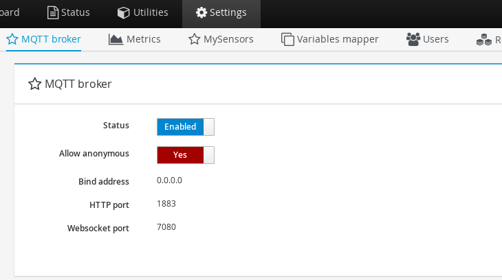
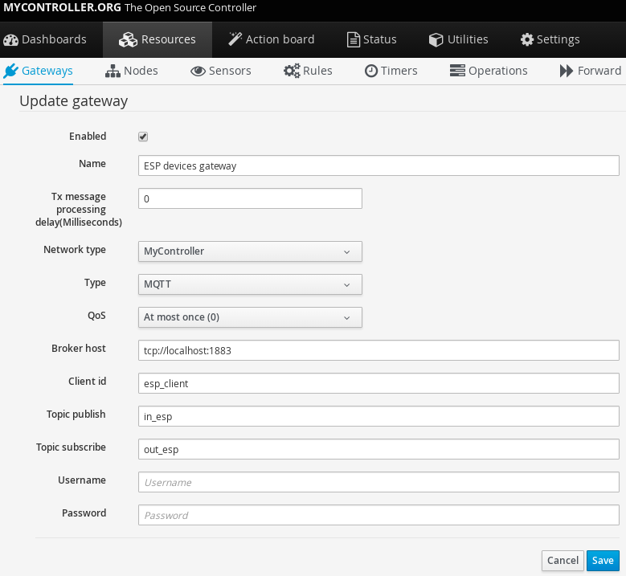
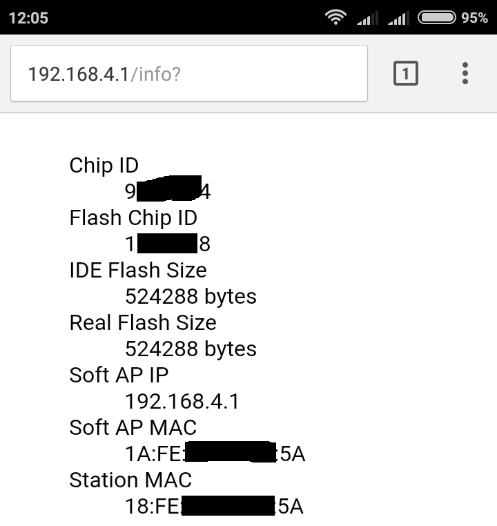
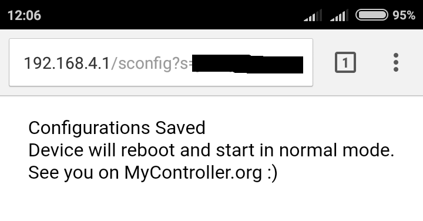

= MyControllerDevice


**IMPOERTANT**: For now this library supports up to `ESP 8266 community version: 2.3.0` If you compile with `2.4.0` or greater version. This code will not work as expected.

== About

*MyControllerDevice* is network driver for embedded devices to communicate with MyController. You can make your own sensors network on top of embedded hardwares. Currently this library supports for ESP8266 via MQTT protocol

=== Dependencies
When you compile you have to change the following settings on dependencies,

==== https://github.com/knolleary/pubsubclient[pubsubclient]
* Change `MQTT_MAX_PACKET_SIZE` to 512 bytes on https://github.com/knolleary/pubsubclient/blob/master/src/PubSubClient.h[PubSubClient.h]

== Quick start
* Download dependencies to your arduino environment.
* Download this library to your arduino library location
* Have a look on example
* Implement your code


=== Add your code on this default code
```
#include <MyController.h>

MyController mc;

void before(){
  //Your code before this library inialize
}

void presentation(){
  //Presentation code, to send available sensors detail
}

void receiveTime(unsigned long mcTimestamp){
  //Do something with received time
}

void receive(McMessage &message) {
   //If MyController sends some data, you will receive here.
}


void setup() {
  if(!isSystemConfigured()){
    //You can check, does this node/device configured. If no you can display/blink some led from here.
  }
}

void loop() {
  mc.loop();
  //You can add your logic here.
}
```

==== Compile and update code to ESP8266
* Select target board
* click on compile and update

==== OTA support
If you have 4M of program space you can do OTA program. To use OTA you need MyController and very first you have burn firmware for your device from computer.

== First time configuration
We have to create gateway entry on MyController server and we have supply those settings to node/esp8266 one time.

=== Gateway settings on MyController server
Please note, here I have used MyController inbuilt MQTT broker. Which will not allow `anonymous` by defaylt. We have to enable `anonymous`. We can use with user details also. In the following screenshot I have shown as `anonymous`.
We can use any MQTT broker.

===== Allow anonymous


===== Gateway settings for ESP8266


=== Configuration on ESP8266
Once the firmware successfully uploaded to ESP8266, When you turn on the device. We can see a Access Point(AP) somthing like `ESP_XXXXXX`(default password: `mycontroller`) this is your device AP. You have to connect your mobile or computer to update MyController and actual AP settings for your ESP8266. Once you have connected to ESP device AP, you have to enter the following IP on your browser `192.168.4.1`. Annd follow these steps,

===== WiFi ESP_XXXXXX
image::extra/images/esp_01.png[ESP AP on WiFi settings, height=720]

===== On browser open `192.168.4.1`
image::extra/images/esp_02.png[192.168.4.1 on browser, height=320]

===== To know about device information click on `Info`


===== Configure actual AP settings and MQTT broker settings
image::extra/images/esp_04.png[Ap and ESP settings, height=720]

===== When you save the settings, Self AP will get disabled and ESP8266 will connect with your AP and connect with MQTT broker (Here we use inbuilt MQTT broker)

